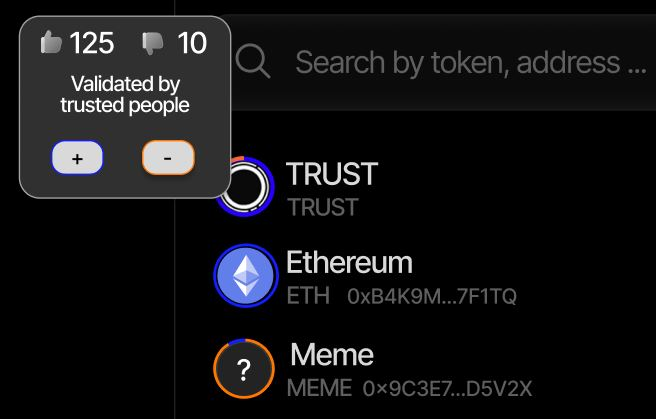

### **Trust Gauge**

* Each listed token displays a **visual trust gauge**, representing community sentiment.
* Votes are linked to a verifiable triple (e.g., **TOKEN – WHITELISTED – TRUSTSWAP**).

---
### **Reputation-Weighted Listing**

* Only tokens validated by users with **meaningful on-chain reputation** are whitelisted.
* A user’s reputation directly **influences the weight** of their vote.
* Tokens can be **automatically delisted** if they receive too many negative votes or credible negative claims (e.g., “Team exit scam,” “Rug pull detected”).
* Verified pools appear in the main interface, while unverified ones remain hidden or grouped in an **experimental** section.

---

### **Machine-Readable Trust Layer**

A key aspect of this **trust layer** lies in its **readability by trading agents**, which today play a major role in the DeFi landscape. Each **token**, **pool**, **team**, or even **agent** will inherit a **programmable TrustScore** (powered by verifiable triples) that both the interface and **trading agents** can leverage to **adapt routing, slippage, and order limits** in real time.

---

### **Knowledge Graph Integration**

* Every token is connected to **on-chain triples** (e.g., *Team doxxed*, *Audit completed by …*).
* Users can **explore the knowledge graph**, revealing the relationships between a token and its surrounding ecosystem.

---

### **Social Trading Overlay**

* **Trust positions** become public (e.g., “20 reputable addresses voted for this token”).
* Users can **follow the reputation** of other wallets, similar to following traders.
* Trading data evolves from simple **volume metrics** to **volume-plus-reputation indicators**, merging market activity with verified trust.

